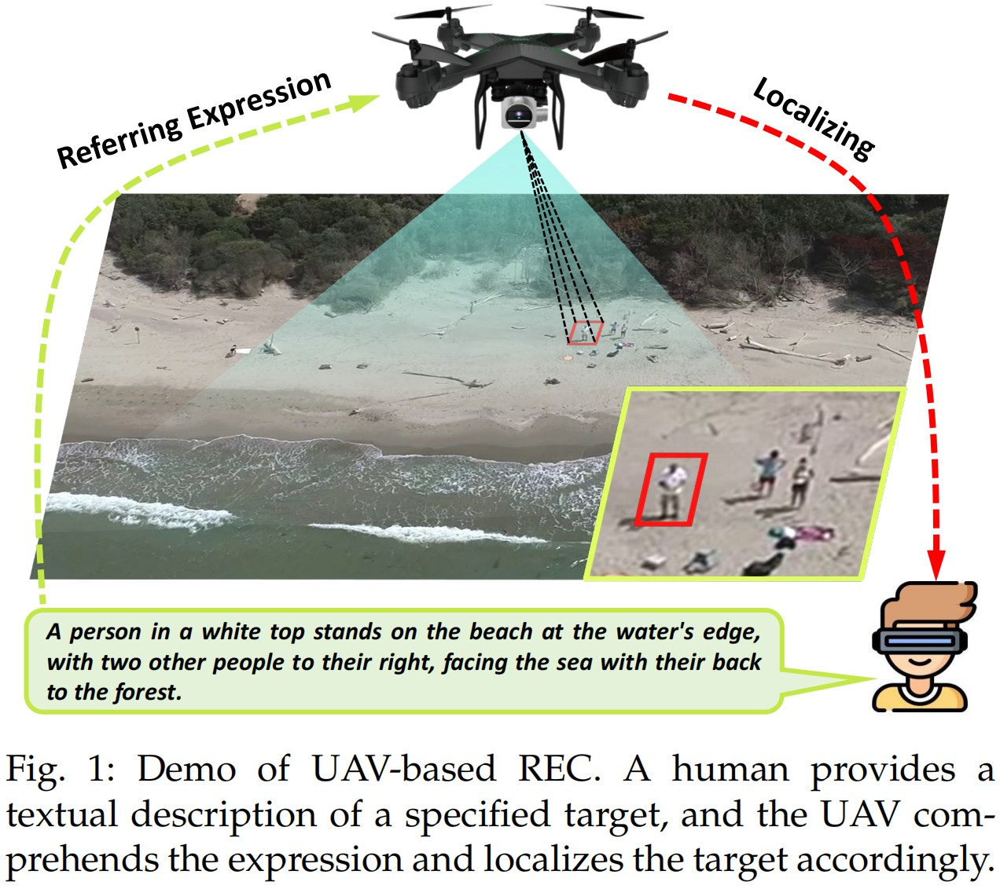
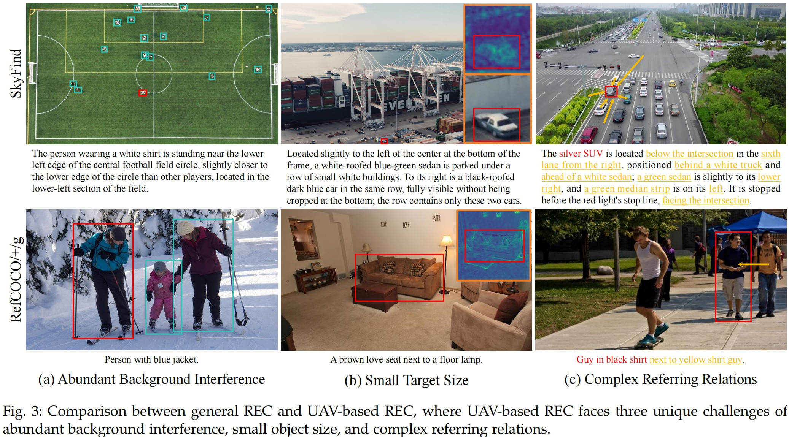
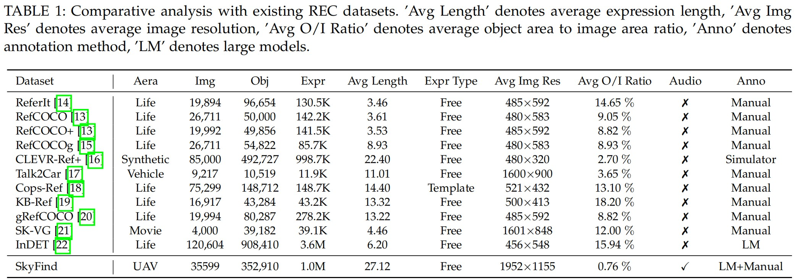
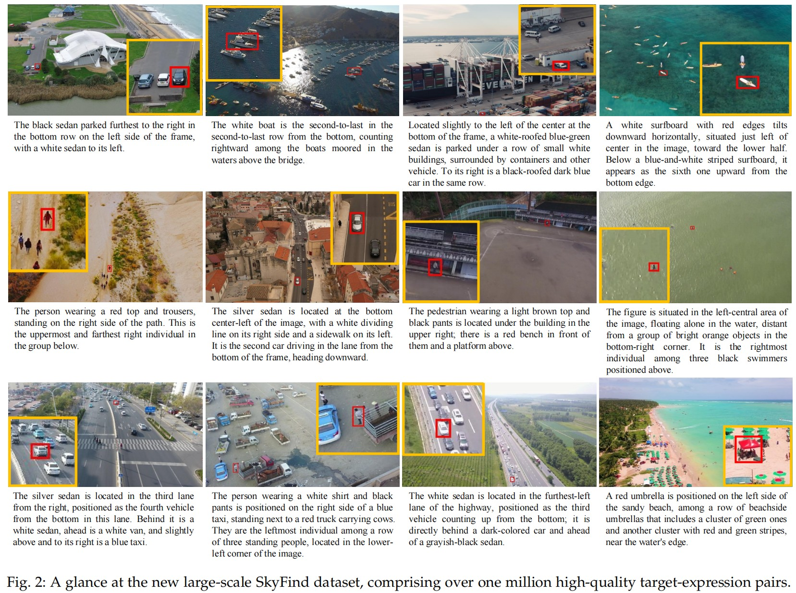

# SkyFind: A Large-Scale Benchmark Unveiling Referring Expression Comprehension for UAV

## 🌟 Highlights
- **New Task Definition**: We formally introduce **UAV-based REC**, focusing on human–UAV interaction via natural language.
- **Large-Scale Dataset**: We release **SkyFind**, a dataset with over 1M target–expression pairs across diverse UAV scenarios.
- **Baseline Method**: We propose **AerialREC**, a two-step localization framework tailored for aerial scenarios, effectively addressing the unique difficulties of UAV-based REC.

---
## 🚀 Motivation
Unmanned Aerial Vehicles (UAV) are increasingly used in surveillance, rescue, and delivery tasks. For effective collaboration, UAV need to understand human intentions and objectives, which is essential for subsequent actions. Since language is the most direct and natural medium through which humans convey their intentions, it becomes a critical source of information for UAV to understand task objectives. This motivates the study of **UAV-based Referring Expression Comprehension (REC)**, which connects linguistic expressions with specific targets within the visual scene, enabling UAV to interpret human intent and perform subsequent tasks.

  

---

## ⚡ Unique Challenges of UAV-based REC
Compared with general REC (RefCOCO, RefCOCO+, RefCOCOg), UAV-based REC introduces three distinct challenges:

1. **Abundant Background Interference**  
   The wide field of view in UAV imagery often leads to scenes with rich semantic content, containing numerous non-target entities that resemble the target. Such distracting entities in the background increase the difficulty of localization.

2. **Small Target Size**  
   UAV imagery typically follows a ”large scene, small object” pattern, where the target occupies only a small fraction of the frame. Such target often has blurred boundary and weak texture, which increase the difficulty of recognition.

3. **Complex Referring Relations**  
   To identify a target in cluttered UAV imagery, referring expressions often incorporate fine-grained details, making them longer, characterized by more intricate reference relations, and consequently more difficult to comprehend.

  

---

## 📊 SkyFind Dataset
We construct **SkyFind**, the first large-scale dataset for UAV-based REC.

- **Scale**: 1,015,638 target–expression pairs, 35,599 images, 352,910 objects.
- **Split**: 331,364 (train), 5,000 (val), 16,546 (test). Test set sourced from distinct maritime datasets to ensure distribution shift.
- **Diversity**: Each original expression in the training set is augmented with **two additional variants** generated by GPT-4, expanding linguistic coverage with varied vocabulary and sentence structures. This triples the data volume (331,364 → 331,364 × 3).

  

  

---

